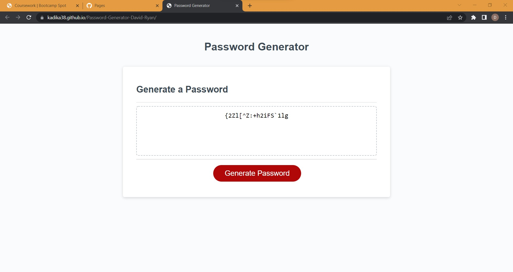

# <Password-Generator-David-Ryan>
Homework 03 Password Generator project: a website that uses javascript within a basic html/css page to generate a random password within user defined parameters

## Description

This is a simple password generator.  When the user clicks on the "Generate Password" button, a series of prompts and confirms appears and takes user input to define the parameters of a newly generated random password.
These dialogues will define the length of the password and the use of lower case, upper case, numeric, and special characters.
Once this has been completed by the user, the text box above the button will display the newly generated password.

This is done in a relatively simple manner.  All the function comes from the javascript.
First an event listener is added to the button.  
A generatePassword function is created with the following:
Characters are stored in arrays, grouped as lower case, upper case, numeric, and special characters.
A prompt is used to store the desired length of the password.
A while loop checks that the length is between and 8 and 128, and will not allow the user to continue until they input a valid number.
A series of confirms stores booleans about what types of characters will be used in the password.
A while loop checks that at least one type of character set has been chosen.  If not than it will offer to cancel the function with a confirm.
If the user does not cancel it, they are taken back through the character set choices until they have chosen at least one set.
Using the boolean values stored from these confirms, an array is created of all the characters the user wants available to the password generator.
Next a math.random function nested in a for loop is used to pick the characters of the password and that password is stored in an array.
The function returns that array after using the join function on it.
In other words, it returns the password as a string with no spaces between the characters instead of as an array.
A writePassword function is defined to run the generatePassword function and show the password as text within the #password element of the html.
Finally, the button event listener runs that writePassword when the button is clicked.

## Screenshot

## Link to Deployed Website

https://kadika38.github.io/Password-Generator-David-Ryan/